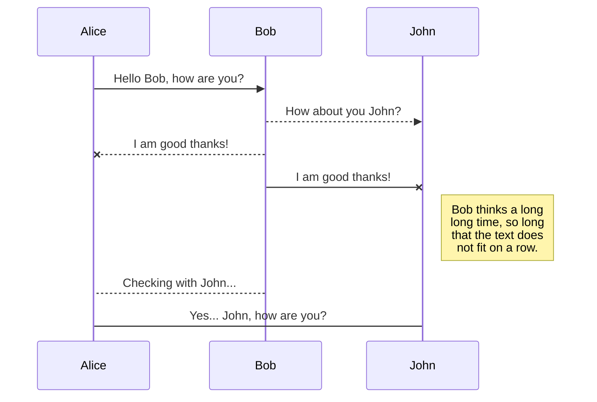
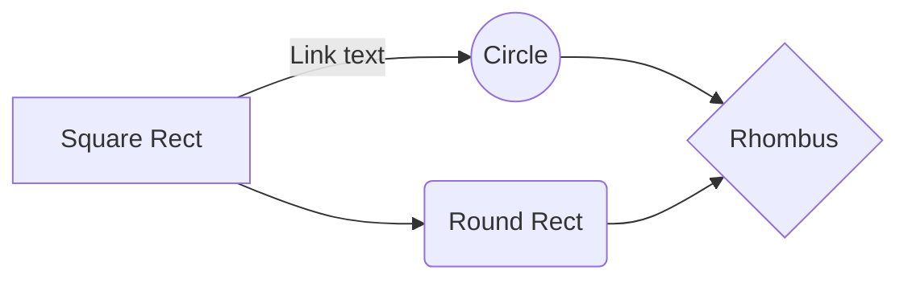

# United Credit Education Services (UCES)

This project is an educational project recreating most text and images from https://www.ucesprotectionplan.com/default.aspx?rid=tjohnson224.  

United Credit Education Services offers products that are used as tools to increase financial literacy.  The primary product is the UCES Protection Plan, designed to support financial opportunities by implementing positive habits to create and maintain a strong financial future.

The website is deployed to https://uces.herokuapp.com/.

## UX
The website is designed to enable individuals to gain detailed knowledge of the products included in the UCES Protection Plan, enroll in the service, and login to gain access to those services.

User Stories:
-   As a user type, I want to perform an action, so that I can achieve a goal.

## Features

### Existing Features

-   **What's Included** - allows users to use Learn More link to view details of listed services within UCES.
-   **Contact** - allows user to input data to send to site owner.
-   **Login** -  allows user to input data to login to system.
-   **Google Play** app link - routes user to location for download of Google Play mobile app for UCES.
-   **Apple Store** app link -  routes user to location for download of Apple Store mobile app for UCES.
-   **Email** - allows user to use link to trigger system default email service to compose email.
-   **Phone** - allows user to use link to trigger system default telephone service to make phone call.
-   **COVID-19** alert - allows user to be informed of alert and close when required.

### Features Left to Implement

-   **Enroll** - allows user to input data and payment information to gain access to valid login credentials.
-   **Login** -  allows user to authenticate to access services previously enrolled for.
-   **Contact** - allows system owner to view messages sent by user via contact form.

#### Known issues:

 - [ ] decrease font size for .site-heading-agent-info on base.html
 - [ ] cancel use of max-width: 60vm on .product-item-img
 - [ ] remove inline styling in service.html
 - [ ] remove inline styling in index.html
 - [ ]  update href for Login button on login.html
 - [ ] update form layout on enroll.html
 - [ ] fix google play link
 - [ ] fix enroll button on services.html
 - [ ] fix have account link on enroll.html
 - [ ]  fix form validation on contact.html
 - [ ] fix form validation on login.html

## Technologies Used

-   [JQuery](https://jquery.com/)
    -   The project uses  **JQuery**  to simplify DOM manipulation.

## Testing
### Scenarios
- Go to the **Home** page:
    1. Try to click email link in header and verify load of system default email service.
    2. Try to click phone link in header and verify load of system default telephone service.
    3. Try to click Home link in navbar and verify  '/' url.
    4. Try to click What's Included link in navbar and verify '/services' url.
    5. Try to click Contact link in navbar and verify '/login' url.
    6. Try to click Enroll Now! button and verify '/enroll' url 
    7. Try to click Enroll Now! button and verify enrollment form displays.
    8. Try to click What's Included button and verify '/services' url.
    9. Try to click What's Included button and display of services available.
- Go to **Footer**:
	1. Try to click Google Play button and verify  '[https://play.google.com/store/apps/details?id=com.fes.uces](https://play.google.com/store/apps/details?id=com.fes.uces)' url.
	2.  Try to click Apple Store button and verify  '[https://apps.apple.com/us/app/uces-pp/id1483644801](https://apps.apple.com/us/app/uces-pp/id1483644801)' url.
- Go to the **What's Included** page:
    1.  Try to click Enroll Now! button and verify '/enroll' url.
    2.  Try to click Enroll Now! button and verify enrollment form displays.
    3.  Try to click Budgeting icon link
    4.  Try to click Budgeting Learn More link
    5. Try to click Credit Restoration icon link
    6. Try to click  Credit Restoration Learn More link
    7. Try to click Credit Builder icon link
    8. Try to click  Credit Builder Learn More link
    9. Try to click Credit Attorney icon link
    10. Try to click Credit Attorney Learn More link:
- What's Included, Credit Monitoring icon link:
- What's Included, Credit Monitoring Learn More link:
- What's Included, Debt Payoff icon link:
- What's Included, Debt Payoff Learn More link:
- What's Included, Identity Monitoring icon link:
- What's Included, Identity Monitoring Learn More link:
- What's Included, Life Insurance icon link:
- What's Included, Life Insurance Learn More link:
- What's Included, Financial Lockbox icon link:
- What's Included, Financial Lockbox Learn More link:
- What's Included, Net Worth icon link:
- What's Included, Net Worth Learn More link:
- What's Included, Savings Goals icon link:
- What's Included, Savings Goals Learn More link:
- What's Included, Will & Trust icon link:
- What's Included, Will & Trust Learn More link:
- What's Included, YFL Family Mint icon link:
- What's Included, YFL Family Mint Learn More link:
- Go to the **Contact Us** page:
    1.  Try to submit the empty form and verify that an error message about the required fields appears.
    2.  Try to submit the form with an invalid email address and verify that a relevant error message appears.
    3. Try to submit the form without a message and verify that an error message about the required fields appears.
    4.  Try to submit the form with all inputs valid and verify that a success message appears.
- **Login**: 
	- form validation
- **Enroll**: 
	- form validation
In this section, you need to convince the assessor that you have conducted enough testing to legitimately believe that the site works well. Essentially, in this part you will want to go over all of your user stories from the UX section and ensure that they all work as intended, with the project providing an easy and straightforward way for the users to achieve their goals.

Whenever it is feasible, prefer to automate your tests, and if you've done so, provide a brief explanation of your approach, link to the test file(s) and explain how to run them.

For any scenarios that have not been automated, test the user stories manually and provide as much detail as is relevant. A particularly useful form for describing your testing process is via scenarios, such as:

1.  Contact form:
    1.  Go to the "Contact Us" page
    2.  Try to submit the empty form and verify that an error message about the required fields appears
    3.  Try to submit the form with an invalid email address and verify that a relevant error message appears
    4.  Try to submit the form with all inputs valid and verify that a success message appears.

In addition, you should mention in this section how your project looks and works on different browsers and screen sizes.

You should also mention in this section any interesting bugs or problems you discovered during your testing, even if you haven't addressed them yet.

If this section grows too long, you may want to split it off into a separate file and link to it from here.

## Deployment

This section should describe the process you went through to deploy the project to a hosting platform (e.g. GitHub Pages or Heroku).

In particular, you should provide all details of the differences between the deployed version and the development version, if any, including:

-   Different values for environment variables (Heroku Config Vars)?
-   Different configuration files?
-   Separate git branch?

In addition, if it is not obvious, you should also describe how to run your code locally.

## Credits

###)Content

-   The text for the site was copied from https://www.ucesprotectionplan.com/default.aspx?rid=tjohnson224.

### Media

-   The photos used in this site were obtained from Google images.

### Acknowledgements

-   I received inspiration for this project from template: https://startbootstrap.com/previews/business-casual/

 

# Welcome to StackEdit!

Hi! I'm your first Markdown file in **StackEdit**. If you want to learn about StackEdit, you can read me. If you want to play with Markdown, you can edit me. Once you have finished with me, you can create new files by opening the **file explorer** on the left corner of the navigation bar.

# Files

StackEdit stores your files in your browser, which means all your files are automatically saved locally and are accessible **offline!**

## Create files and folders

The file explorer is accessible using the button in left corner of the navigation bar. You can create a new file by clicking the **New file** button in the file explorer. You can also create folders by clicking the **New folder** button.

## Switch to another file

All your files and folders are presented as a tree in the file explorer. You can switch from one to another by clicking a file in the tree.

## Rename a file

You can rename the current file by clicking the file name in the navigation bar or by clicking the **Rename** button in the file explorer.

## Delete a file

You can delete the current file by clicking the **Remove** button in the file explorer. The file will be moved into the **Trash** folder and automatically deleted after 7 days of inactivity.

## Export a file

You can export the current file by clicking **Export to disk** in the menu. You can choose to export the file as plain Markdown, as HTML using a Handlebars template or as a PDF.

# Synchronization

Synchronization is one of the biggest features of StackEdit. It enables you to synchronize any file in your workspace with other files stored in your **Google Drive**, your **Dropbox** and your **GitHub** accounts. This allows you to keep writing on other devices, collaborate with people you share the file with, integrate easily into your workflow... The synchronization mechanism takes place every minute in the background, downloading, merging, and uploading file modifications.

There are two types of synchronization and they can complement each other:

- The workspace synchronization will sync all your files, folders and settings automatically. This will allow you to fetch your workspace on any other device.
	> To start syncing your workspace, just sign in with Google in the menu.

- The file synchronization will keep one file of the workspace synced with one or multiple files in **Google Drive**, **Dropbox** or **GitHub**.
	> Before starting to sync files, you must link an account in the **Synchronize** sub-menu.

## Open a file

You can open a file from **Google Drive**, **Dropbox** or **GitHub** by opening the **Synchronize** sub-menu and clicking **Open from**. Once opened in the workspace, any modification in the file will be automatically synced.

## Save a file

You can save any file of the workspace to **Google Drive**, **Dropbox** or **GitHub** by opening the **Synchronize** sub-menu and clicking **Save on**. Even if a file in the workspace is already synced, you can save it to another location. StackEdit can sync one file with multiple locations and accounts.

## Synchronize a file

Once your file is linked to a synchronized location, StackEdit will periodically synchronize it by downloading/uploading any modification. A merge will be performed if necessary and conflicts will be resolved.

If you just have modified your file and you want to force syncing, click the **Synchronize now** button in the navigation bar.

> **Note:** The **Synchronize now** button is disabled if you have no file to synchronize.

## Manage file synchronization

Since one file can be synced with multiple locations, you can list and manage synchronized locations by clicking **File synchronization** in the **Synchronize** sub-menu. This allows you to list and remove synchronized locations that are linked to your file.

# Publication

Publishing in StackEdit makes it simple for you to publish online your files. Once you're happy with a file, you can publish it to different hosting platforms like **Blogger**, **Dropbox**, **Gist**, **GitHub**, **Google Drive**, **WordPress** and **Zendesk**. With [Handlebars templates](http://handlebarsjs.com/), you have full control over what you export.

> Before starting to publish, you must link an account in the **Publish** sub-menu.

## Publish a File

You can publish your file by opening the **Publish** sub-menu and by clicking **Publish to**. For some locations, you can choose between the following formats:

- Markdown: publish the Markdown text on a website that can interpret it (**GitHub** for instance),
- HTML: publish the file converted to HTML via a Handlebars template (on a blog for example).

## Update a publication

After publishing, StackEdit keeps your file linked to that publication which makes it easy for you to re-publish it. Once you have modified your file and you want to update your publication, click on the **Publish now** button in the navigation bar.

> **Note:** The **Publish now** button is disabled if your file has not been published yet.

## Manage file publication

Since one file can be published to multiple locations, you can list and manage publish locations by clicking **File publication** in the **Publish** sub-menu. This allows you to list and remove publication locations that are linked to your file.

# Markdown extensions

StackEdit extends the standard Markdown syntax by adding extra **Markdown extensions**, providing you with some nice features.

> **ProTip:** You can disable any **Markdown extension** in the **File properties** dialog.

## SmartyPants

SmartyPants converts ASCII punctuation characters into "smart" typographic punctuation HTML entities. For example:

|                |ASCII                          |HTML                         |
|----------------|-------------------------------|-----------------------------|
|Single backticks|`'Isn't this fun?'`            |'Isn't this fun?'            |
|Quotes          |`"Isn't this fun?"`            |"Isn't this fun?"            |
|Dashes          |`-- is en-dash, --- is em-dash`|-- is en-dash, --- is em-dash|

## KaTeX

You can render LaTeX mathematical expressions using [KaTeX](https://khan.github.io/KaTeX/):

The *Gamma function* satisfying $\Gamma(n) = (n-1)!\quad\forall n\in\mathbb N$ is via the Euler integral

$$
\Gamma(z) = \int_0^\infty t^{z-1}e^{-t}dt\,.
$$

> You can find more information about **LaTeX** mathematical expressions [here](http://meta.math.stackexchange.com/questions/5020/mathjax-basic-tutorial-and-quick-reference).

## UML diagrams

You can render UML diagrams using [Mermaid](https://mermaidjs.github.io/). For example, this will produce a sequence diagram:

And this will produce a flow chart:

