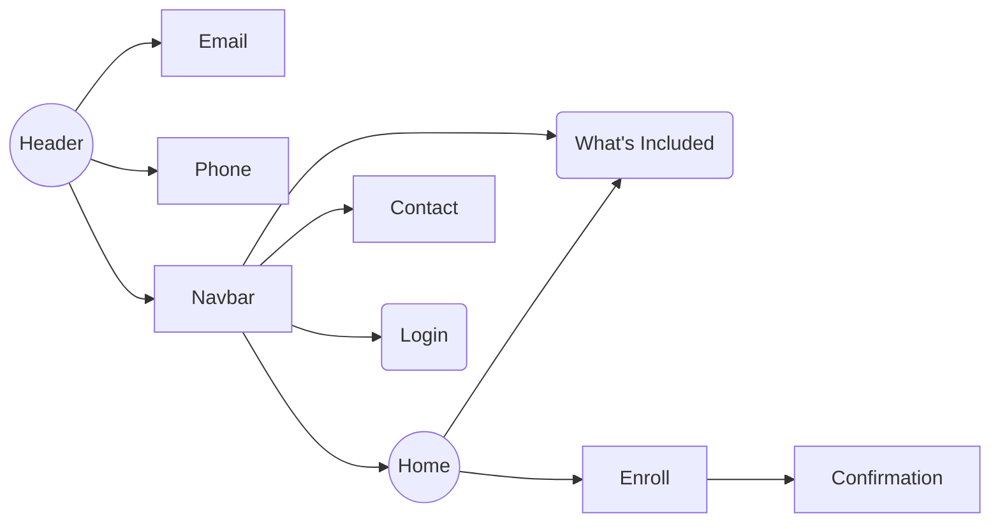
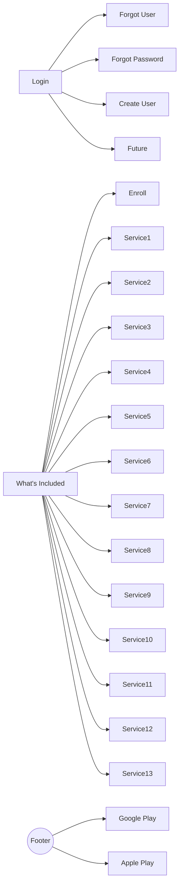

# United Credit Education Services (UCES)

This project is an educational project recreating most text and images from https://www.ucesprotectionplan.com/default.aspx?rid=tjohnson224.  

United Credit Education Services offers products that are used as tools to increase financial literacy.  The primary product is the UCES Protection Plan, designed to support financial opportunities by implementing positive habits to create and maintain a strong financial future.

The website is deployed to https://uces.herokuapp.com/.

## UX
The website is designed to enable individuals to gain detailed knowledge of the products included in the UCES Protection Plan, enroll in the service, and login to gain access to those services.

User Stories:
-   As a user type, I want to perform an action, so that I can achieve a goal.

## Features

### Existing Features

-   **What's Included** - allows users to use Learn More link to view details of listed services within UCES.
-   **Contact** - allows user to input data to send to site owner.
-   **Login** -  allows user to input data to login to system.
-   **Google Play** app link - routes user to location for download of Google Play mobile app for UCES.
-   **Apple Store** app link -  routes user to location for download of Apple Store mobile app for UCES.
-   **Email** - allows user to use link to trigger system default email service to compose email.
-   **Phone** - allows user to use link to trigger system default telephone service to make phone call.
-   **COVID-19** alert - allows user to be informed of alert and close when required.

### Features Left to Implement

-   **Enroll** - allows user to input data and payment information to gain access to valid login credentials.
-   **Login** -  allows user to authenticate to access services previously enrolled for.
-   **Contact** - allows system owner to view messages sent by user via contact form.

#### Known issues:

 - [ ] decrease font size for .site-heading-agent-info on base.html
 - [ ] cancel use of max-width: 60vm on .product-item-img
 - [ ] remove inline styling in service.html
 - [ ] remove inline styling in index.html
 - [ ]  update href for Login button on login.html
 - [ ] update form layout on enroll.html
 - [ ] fix google play link
 - [ ] fix enroll button on services.html
 - [ ] fix have account link on enroll.html
 - [ ]  fix form validation on contact.html
 - [ ] fix form validation on login.html

## Technologies Used

-   [HTML5](https://developer.mozilla.org/en-US/docs/Web/Guide/HTML/HTML5)
	- The project uses HTML5, a markup language used for structuring and presenting content on the World Wide Web.
- [CSS3](https://www.w3.org/Style/CSS/current-work.en.html)
	- The project uses Cascading Style Sheets, a style sheet language used for describing the presentation of a document written in a markup language like HTML.
- [JavaScript](https://www.javascript.com/)
	- The project uses JavaScript, a programming language that conforms to the ECMAScript specification.
- ([Python](https://www.python.org/))
    -   The project uses Python, an interpreted, high-level, general-purpose programming language.
- [Flask](https://flask.palletsprojects.com/en/1.1.x/)
	- The project uses Flask, which depends on the Jinja template engine and the Werkzeug WSGI toolkit.
-  [StackEdit](https://www.stackedit.io)
	- README.md was generated within StackEdit, a full-featured, open-source Markdown editor based on PageDown, the Markdown library used by Stack Overflow and the other Stack Exchange sites.

## Testing
### Scenarios
- Go to the **Home** page:
    1. Try to click email link in header and verify load of system default email service.
    2. Try to click phone link in header and verify load of system default telephone service.
    3. Try to click Home link in navbar and verify  '/' url.
    4. Try to click What's Included link in navbar and verify '/services' url.
    5. Try to click Contact link in navbar and verify '/login' url.
    6. Try to click Enroll Now! button and verify '/enroll' url 
    7. Try to click Enroll Now! button and verify enrollment form displays.
    8. Try to click What's Included button and verify '/services' url.
    9. Try to click What's Included button and display of services available.
- Go to **Footer**:
	1. Try to click Google Play button and verify  '[https://play.google.com/store/apps/details?id=com.fes.uces](https://play.google.com/store/apps/details?id=com.fes.uces)' url.
	2.  Try to click Apple Store button and verify  '[https://apps.apple.com/us/app/uces-pp/id1483644801](https://apps.apple.com/us/app/uces-pp/id1483644801)' url.
- Go to the **What's Included** page:
    1.  Try to click Enroll Now! button and verify '/enroll' url.
    2.  Try to click Enroll Now! button and verify enrollment form displays.
    3.  Try to click Budgeting icon link
    4.  Try to click Budgeting Learn More link
    5. Try to click Credit Restoration icon link
    6. Try to click  Credit Restoration Learn More link
    7. Try to click Credit Builder icon link
    8. Try to click  Credit Builder Learn More link
    9. Try to click Credit Attorney icon link
    10. Try to click Credit Attorney Learn More link:
- What's Included, Credit Monitoring icon link:
- What's Included, Credit Monitoring Learn More link:
- What's Included, Debt Payoff icon link:
- What's Included, Debt Payoff Learn More link:
- What's Included, Identity Monitoring icon link:
- What's Included, Identity Monitoring Learn More link:
- What's Included, Life Insurance icon link:
- What's Included, Life Insurance Learn More link:
- What's Included, Financial Lockbox icon link:
- What's Included, Financial Lockbox Learn More link:
- What's Included, Net Worth icon link:
- What's Included, Net Worth Learn More link:
- What's Included, Savings Goals icon link:
- What's Included, Savings Goals Learn More link:
- What's Included, Will & Trust icon link:
- What's Included, Will & Trust Learn More link:
- What's Included, YFL Family Mint icon link:
- What's Included, YFL Family Mint Learn More link:
- Go to the **Contact Us** page:
    1.  Try to submit the empty form and verify that an error message about the required fields appears.
    2.  Try to submit the form with an invalid email address and verify that a relevant error message appears.
    3. Try to submit the form without a message and verify that an error message about the required fields appears.
    4.  Try to submit the form with all inputs valid and verify that a success message appears.
- **Login**: 
	- form validation
- **Enroll**: 
	- form validation
In this section, you need to convince the assessor that you have conducted enough testing to legitimately believe that the site works well. Essentially, in this part you will want to go over all of your user stories from the UX section and ensure that they all work as intended, with the project providing an easy and straightforward way for the users to achieve their goals.

Whenever it is feasible, prefer to automate your tests, and if you've done so, provide a brief explanation of your approach, link to the test file(s) and explain how to run them.

For any scenarios that have not been automated, test the user stories manually and provide as much detail as is relevant. A particularly useful form for describing your testing process is via scenarios, such as:

1.  Contact form:
    1.  Go to the "Contact Us" page
    2.  Try to submit the empty form and verify that an error message about the required fields appears
    3.  Try to submit the form with an invalid email address and verify that a relevant error message appears
    4.  Try to submit the form with all inputs valid and verify that a success message appears.

In addition, you should mention in this section how your project looks and works on different browsers and screen sizes.

You should also mention in this section any interesting bugs or problems you discovered during your testing, even if you haven't addressed them yet.

If this section grows too long, you may want to split it off into a separate file and link to it from here.

## Deployment

This section should describe the process you went through to deploy the project to a hosting platform (e.g. GitHub Pages or Heroku).

In particular, you should provide all details of the differences between the deployed version and the development version, if any, including:

-   Different values for environment variables (Heroku Config Vars)?
-   Different configuration files?
-   Separate git branch?

In addition, if it is not obvious, you should also describe how to run your code locally.

## Credits

###)Content

-   The text for the site was copied from https://www.ucesprotectionplan.com/default.aspx?rid=tjohnson224.

### Media

-   The photos used in this site were obtained from Google images.

### Acknowledgements

-   I received inspiration for this project from template: https://startbootstrap.com/previews/business-casual/

## UML diagrams

